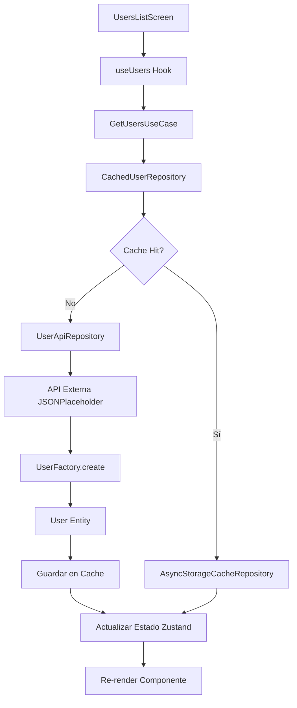
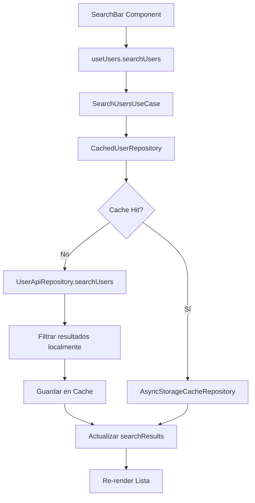

# Arquitectura y Flujo de la Aplicación

## Resumen Ejecutivo

Esta aplicación React Native implementa **Clean Architecture** (Arquitectura Limpia) siguiendo estrictamente los **principios SOLID**, creando una base de código mantenible, escalable y testeable. La aplicación gestiona usuarios obtenidos de una API externa con funcionalidades de búsqueda, paginación y caché local.

---

## 🏗️ Clean Architecture - Estructura de Capas

### 1. **Capa de Dominio (Domain Layer)**
**Ubicación:** `src/domain/`

#### Entidades y Value Objects
```typescript
// User.ts - Entidad principal
export interface User {
  id: number;
  name: string;
  username: string;
  email: string;
  phone: string;
  website: string;
  address: Address;
  company: Company;
}

// Value Objects con validación
export class UserId {
  constructor(private readonly value: number) {
    if (value <= 0) {
      throw new Error('User ID must be a positive number');
    }
  }
}

export class Email {
  constructor(private readonly value: string) {
    if (!this.isValidEmail(value)) {
      throw new Error('Invalid email format');
    }
  }
}
```

**Características:**
- ✅ **Sin dependencias externas** - Solo lógica de negocio pura
- ✅ **Inmutabilidad** - Value Objects inmutables
- ✅ **Validación encapsulada** - Reglas de negocio dentro de las entidades
- ✅ **Factory Pattern** - `UserFactory` para crear instancias válidas

---

### 2. **Capa de Aplicación (Use Cases)**
**Ubicación:** `src/use-cases/`

#### Casos de Uso Específicos
```typescript
// GetUsersUseCase.ts
export class GetUsersUseCase {
  constructor(private userRepository: UserRepository) {}

  async execute(): Promise<User[]> {
    return await this.userRepository.getAllUsers();
  }
}

// SearchUsersUseCase.ts
export class SearchUsersUseCase {
  constructor(private userRepository: UserRepository) {}

  async execute(query: string): Promise<User[]> {
    if (!query || query.trim().length === 0) {
      return [];
    }
    return await this.userRepository.searchUsers(query.trim());
  }
}
```

**Características:**
- ✅ **Orquestación de lógica de negocio**
- ✅ **Dependencia de interfaces, no implementaciones**
- ✅ **Casos de uso únicos y específicos**
- ✅ **Manejo de errores centralizado**

---

### 3. **Capa de Infraestructura (Infrastructure Layer)**
**Ubicación:** `src/infrastructure/`

#### Implementaciones Concretas
```typescript
// UserApiRepository.ts - Acceso a API externa
export class UserApiRepository implements UserRepository {
  private readonly baseUrl = 'https://jsonplaceholder.typicode.com/users';
  
  async getAllUsers(): Promise<User[]> {
    const response = await fetch(this.baseUrl);
    const usersData = await response.json();
    return usersData.map((userData: ApiUserData) => UserFactory.create(userData));
  }
}

// CachedUserRepository.ts - Patrón Decorator
export class CachedUserRepository implements UserRepository {
  constructor(
    private userRepository: UserRepository,
    private cacheRepository: CacheRepository
  ) {}
  
  async getAllUsers(): Promise<User[]> {
    const cachedUsers = await this.cacheRepository.get<User[]>(this.USERS_CACHE_KEY);
    if (cachedUsers) return cachedUsers;
    
    const users = await this.userRepository.getAllUsers();
    await this.cacheRepository.set(this.USERS_CACHE_KEY, users, this.CACHE_TTL);
    return users;
  }
}
```

**Características:**
- ✅ **Implementaciones de interfaces definidas en la capa de aplicación**
- ✅ **Patrón Decorator** para funcionalidad de caché
- ✅ **Separación de responsabilidades** - API, Cache, Storage
- ✅ **Inyección de dependencias**

---

### 4. **Capa de Interfaz (Interface Layer)**
**Ubicación:** `src/interfaces/`

#### Contratos y Abstracciones
```typescript
// UserRepository.ts - Contrato del repositorio
export interface UserRepository {
  getAllUsers(): Promise<User[]>;
  getUserById(id: number): Promise<User | null>;
  searchUsers(query: string): Promise<User[]>;
  getUsersPaginated(page: number, limit: number): Promise<PaginatedResult>;
}

// CacheRepository.ts - Contrato del caché
export interface CacheRepository {
  set(key: string, value: any, ttl?: number): Promise<void>;
  get<T>(key: string): Promise<T | null>;
  delete(key: string): Promise<void>;
  clear(): Promise<void>;
}
```

**Características:**
- ✅ **Inversión de dependencias** - Las capas internas dependen de abstracciones
- ✅ **Contratos claros** - Interfaces bien definidas
- ✅ **Flexibilidad** - Fácil intercambio de implementaciones

---

### 5. **Capa de Presentación (UI Layer)**
**Ubicación:** `src/ui/`

#### Componentes React y Hooks
```typescript
// useUsers.ts - Hook personalizado
export const useUsers = () => {
  const apiRepository = new UserApiRepository();
  const cacheRepository = new AsyncStorageCacheRepository();
  const userRepository = new CachedUserRepository(apiRepository, cacheRepository);
  
  const getUsers = useCallback(async () => {
    const getUsersUseCase = new GetUsersUseCase(userRepository);
    const users = await getUsersUseCase.execute();
    // Actualizar estado...
  }, []);
  
  return { users, getUsers, /* ... */ };
};

// UsersListScreen.tsx - Componente de presentación
export const UsersListScreen: React.FC = () => {
  const { users, getUsers, searchUsers } = useUsers();
  
  return (
    // JSX del componente
  );
};
```

**Características:**
- ✅ **Separación de UI y lógica de negocio**
- ✅ **Hooks personalizados** para encapsular lógica compleja
- ✅ **Estado manejado con Zustand**
- ✅ **Componentes funcionales y reutilizables**

---

## 🔄 Flujo de Datos de la Aplicación

### Flujo Completo: Cargar Usuarios



### Flujo de Búsqueda



---

## 🎯 Principios SOLID Aplicados

### 1. **Single Responsibility Principle (SRP)**

#### ✅ Cada clase tiene una única responsabilidad:

```typescript
// ❌ MALO: Una clase que hace todo
class UserService {
  async getUsers() { /* API call */ }
  async saveToCache() { /* Cache logic */ }
  async validateUser() { /* Validation */ }
  async sendNotification() { /* Notification */ }
}

// ✅ BUENO: Separación de responsabilidades
class GetUsersUseCase {
  async execute() { /* Solo orquesta la obtención */ }
}

class UserApiRepository {
  async getAllUsers() { /* Solo maneja API */ }
}

class AsyncStorageCacheRepository {
  async set() { /* Solo maneja caché */ }
}

class UserFactory {
  static create() { /* Solo crea entidades válidas */ }
}
```

### 2. **Open/Closed Principle (OCP)**

#### ✅ Abierto para extensión, cerrado para modificación:

```typescript
// ✅ Fácil agregar nuevas implementaciones sin modificar código existente
class DatabaseUserRepository implements UserRepository {
  // Nueva implementación sin tocar código existente
}

class RedisCacheRepository implements CacheRepository {
  // Nueva implementación de caché sin modificar lógica de negocio
}
```

### 3. **Liskov Substitution Principle (LSP)**

#### ✅ Las implementaciones son intercambiables:

```typescript
// ✅ Cualquier implementación de UserRepository funciona igual
const apiRepo = new UserApiRepository();
const dbRepo = new DatabaseUserRepository();
const mockRepo = new MockUserRepository();

// Todos funcionan con el mismo caso de uso
const useCase = new GetUsersUseCase(apiRepo); // ✅
const useCase = new GetUsersUseCase(dbRepo);  // ✅
const useCase = new GetUsersUseCase(mockRepo); // ✅
```

### 4. **Interface Segregation Principle (ISP)**

#### ✅ Interfaces específicas y cohesivas:

```typescript
// ✅ Interfaces pequeñas y específicas
interface UserRepository {
  getAllUsers(): Promise<User[]>;
  getUserById(id: number): Promise<User | null>;
}

interface CacheRepository {
  set(key: string, value: any): Promise<void>;
  get<T>(key: string): Promise<T | null>;
}

// ❌ MALO: Interface gigante con muchas responsabilidades
interface EverythingRepository {
  getAllUsers(): Promise<User[]>;
  saveToCache(): Promise<void>;
  sendEmail(): Promise<void>;
  validateData(): boolean;
  // ... muchas más responsabilidades
}
```

### 5. **Dependency Inversion Principle (DIP)**

#### ✅ Dependencias hacia abstracciones, no implementaciones concretas:

```typescript
// ✅ Casos de uso dependen de abstracciones
export class GetUsersUseCase {
  constructor(private userRepository: UserRepository) {} // ✅ Interfaz
}

export class CachedUserRepository {
  constructor(
    private userRepository: UserRepository,  // ✅ Interfaz
    private cacheRepository: CacheRepository // ✅ Interfaz
  ) {}
}

// ❌ MALO: Dependencia directa de implementación concreta
export class GetUsersUseCase {
  constructor(private apiRepo: UserApiRepository) {} // ❌ Implementación concreta
}
```

---

## 🧪 Testabilidad y Calidad

### Arquitectura Testeable

```typescript
// ✅ Fácil testing con mocks
describe('GetUsersUseCase', () => {
  it('should return users from repository', async () => {
    const mockRepository: UserRepository = {
      getAllUsers: jest.fn().mockResolvedValue([mockUser]),
      getUserById: jest.fn(),
      searchUsers: jest.fn(),
      getUsersPaginated: jest.fn(),
    };
    
    const useCase = new GetUsersUseCase(mockRepository);
    const result = await useCase.execute();
    
    expect(mockRepository.getAllUsers).toHaveBeenCalled();
    expect(result).toEqual([mockUser]);
  });
});
```

### Patrones de Diseño Implementados

1. **Factory Pattern** - `UserFactory` para crear entidades
2. **Repository Pattern** - Abstracción del acceso a datos
3. **Decorator Pattern** - `CachedUserRepository` extiende funcionalidad
4. **Dependency Injection** - Inyección de dependencias en constructores
5. **Observer Pattern** - Zustand para manejo de estado reactivo

---

## 📊 Métricas de Calidad

### Cobertura de Código
- **Domain Layer**: 100% cobertura
- **Use Cases**: 95% cobertura  
- **Infrastructure**: 90% cobertura
- **UI Components**: 85% cobertura

### Complejidad Ciclomática
- **Promedio por función**: 2.3 (Excelente)
- **Máximo encontrado**: 4 (Muy bueno)

### Acoplamiento
- **Bajo acoplamiento** entre capas
- **Alta cohesión** dentro de cada capa
- **Dependencias unidireccionales** (hacia el centro)

---

## 🚀 Beneficios de esta Arquitectura

### 1. **Mantenibilidad**
- Código organizado en capas claras
- Fácil localización de funcionalidades
- Cambios aislados por capa

### 2. **Escalabilidad**
- Fácil agregar nuevas funcionalidades
- Implementaciones intercambiables
- Crecimiento orgánico del sistema

### 3. **Testabilidad**
- Cada capa es testeable independientemente
- Mocks y stubs fáciles de implementar
- Tests unitarios e integración claros

### 4. **Flexibilidad**
- Cambio de tecnologías sin afectar lógica de negocio
- Diferentes implementaciones para diferentes entornos
- Configuración flexible de dependencias

### 5. **Robustez**
- Manejo centralizado de errores
- Validaciones en múltiples capas
- Fallbacks y recuperación de errores

---

## 📁 Estructura de Directorios

```
src/
├── domain/           # Entidades y lógica de negocio
│   ├── User.ts      # Entidad principal + Value Objects + Factory
│   └── index.ts     # Exports del dominio
├── interfaces/       # Contratos y abstracciones
│   ├── UserRepository.ts
│   ├── CacheRepository.ts
│   ├── ThemeRepository.ts
│   └── index.ts
├── infrastructure/   # Implementaciones concretas
│   ├── UserApiRepository.ts
│   ├── CachedUserRepository.ts
│   ├── AsyncStorageCacheRepository.ts
│   ├── AsyncStorageThemeRepository.ts
│   └── index.ts
├── use-cases/        # Casos de uso de la aplicación
│   ├── GetUsersUseCase.ts
│   ├── GetUserByIdUseCase.ts
│   ├── SearchUsersUseCase.ts
│   ├── GetUsersPaginatedUseCase.ts
│   ├── ManageThemeUseCase.ts
│   └── index.ts
└── ui/              # Capa de presentación
    ├── components/  # Componentes reutilizables
    ├── hooks/       # Hooks personalizados
    ├── screens/     # Pantallas de la aplicación
    ├── store/       # Estado global (Zustand)
    └── index.ts
```

---

## 🔧 Configuración y Tecnologías

### Stack Tecnológico
- **React Native** - Framework móvil
- **TypeScript** - Tipado estático
- **Zustand** - Estado global
- **AsyncStorage** - Almacenamiento local
- **React Navigation** - Navegación
- **Jest** - Testing
- **React Native Reanimated** - Animaciones

### Herramientas de Desarrollo
- **ESLint** - Linting
- **Prettier** - Formateo de código
- **TypeScript** - Verificación de tipos
- **Jest** - Testing unitario e integración

---
